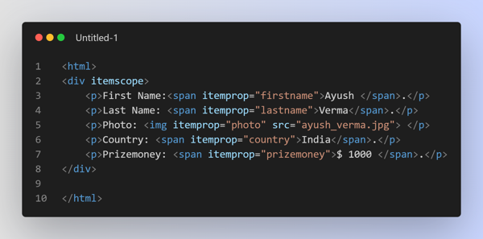
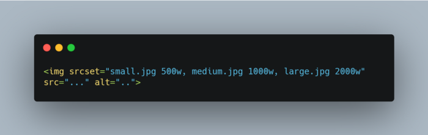

**What is HTML5?**

- HTML stands for HyperText Markup Language. It is used to design web pages using markup language. HTML is the combination of Hypertext and Markup language. Hypertext defines the link between the web pages. Markup language is used to define the text document within tag which defines the structure of web pages.
- HTML 5 is the fifth and current version of HTML. It has improved the markup available for documents and has introduced application programming interfaces(API) and Document Object Model(DOM).

**What are the key new features in HTML5?**

- HTML5 introduces a number of new elements and attributes that can help you in building modern websites. Here is a set of some of the most prominent features introduced in HTML5.
- New Semantic Elements − These are like `<header>`, `<footer>`, `<section>`, `<article>` and `<figure>`.
- Forms 2.0 − Improvements to HTML web forms where new attributes have been introduced for `<input>` tag.
- Persistent Local Storage − Web storage facility which provides web application methods to store data on the web browser.
- WebSocket − A next-generation bidirectional communication technology for web applications.
- Server-Sent Events − HTML5 introduces events which flow from the web server to web browsers and they are called Server-Sent Events (SSE).
- Canvas − This supports a two-dimensional drawing surface that you can program with JavaScript.
- Audio & Video − You can embed audio or video on your web pages without resorting to third-party plugins.
- Geolocation − Now visitors can choose to share their physical location with your web application.
- Microdata − This lets you create your own vocabularies beyond HTML5 and extend your web pages with custom semantics.
- Drag and drop − Drag and drop the items from one location to another location on the same webpage.

**Explain new Form input types in HTML5?**

- `Date`: This is a Date picker, we can pick a date by using type = “date”.
- `Week`: This is a Week picker, we can pick a week by using type = “week”.
- `Month`: This is a Month picker, we can pick a month by using type = “month”.
- `Time`: This is a Time picker, we can pick the time by using type = “time”.
- `Datetime`: This is a combined date and time, we can pick the combination of date and time by using type = “datetime”.
- `Datetime-local`: A combined local date and time, we can pick the combination of local date and time using type = “DateTime-local”.
- `Email`: Allows one or more Email Addresses, we can enter multiple email addresses using type = “email”.
- `Tel`: Allows different phone numbers around the world. A phone number is validated by the client-side. We can enter a phone number using type = “tel”.
- `Search`: Allows to search queries by input text. We can enter multiple queries using type = “search”.
- `Number`: Allows inserting a numerical value with additional attributes such as min, max. etc., and we can enter multiple numerical values using type = “number”.
- `Url`: A url input type, that is used for the web address. In a single url, we can use multiple attributes using type = “url”.
- `Color`: Allows to select multiple colors, we can pic multiple color using type = “color”.
- `Range`: Allows to insert a numerical value within a specific range, Range is similar to the number but it is much specific. We can enter a numerical value within a range using type = “range”.
- `Placeholder`: Allows to display a short hint (usually in a light color) in the input fields, before we enter the value. We can write a short hint in the input field by using type = “placeholder”

**What are HTML Attributes?**

- HTML attributes provide additional information about HTML elements.
- All HTML elements can have attributes. Attributes are always specified in the start tag. Attributes usually come in name/value pairs like: `name=”value”`.
- Example: `href` attribute — The `<a>` tag defines a hyperlink. The `href` attribute specifies the URL of the page the link goes to.

**Can a web page contain multiple `<header>` or `<footer>` elements?**

- Yes to both. In fact, both the `<header>` and `<footer>` tags are designed to serve their respective purposes in relation to whatever their parent “section” may be. So not only can the page `<body>` contain a header and a footer, but so can every `<article>` and `<section>` element. In fact, a `<header>` should be present for all of these, although a `<footer>` is not always necessary.

**What is the minimum number of HTML5 tags that are required to create a Web page?**
- Minimum 3 HTML5 tags are required to create a Web page, such as (`<HEAD>`, `<BODY>`, `<HTML>`).

**What is `<!DOCTYPE>`? What are the different types of `<!DOCTYPE>` that are available?**

- A doctype or document type declaration is an instruction that tells the web browser about the markup language in which the current page is written. The Doctype is not an element or tag, it lets the browser know about the version of or standard of HTML or any other markup language that is being used in the document.
- A DOCTYPE declaration appears at the top of a web page before all other elements. According to the HTML specification or standards, every HTML document requires a document type declaration to ensure that the pages are displayed in the way they are intended to be displayed.
- The DOCTYPE for HTML5 is case-insensitive. It indicates the version of HTML which in this case is 5. The earlier versions like HTML4 were based on Standard Generalised Markup Language (SGML) and required a Document Type Definition (DTD). HTML5 however, is not based on SGML and doesn’t need a DTD.
- The following DOCTYPE are also supported in HTML5: <!DocTYpe html>, <!dOCtype html> and <!doctype html>.
- There are 3 types of DOCTYPES as mentioned below: Strict Doctype, Frameset Doctype and Transitional Doctype.

**What is a `contenteditable` attribute?**

- The `contenteditable` attribute specifies whether the content of an element is editable or not.

**What is image map in HTML5?**

- Image maps are a combination of URL and images, where clicking on these images (clickable area of the image) will open different new web pages.
  Two types of image maps are available in HTML5, i.e. client side and server side: - The client-side image map is created by using two elements `<area>` and `<map>`, where the map holds the map information and the area element takes the attributes to define each section of the map. - Server-side image map created by using `<usemap>` attribute, the usemap attribute is the name of our map.

**What is the Application Cache in HTML5 and why it is used?**

- The Application Cache concept means that a web application is cached. It can be accessible without the need for internet connection.
  Some advantages of Application Cache: 1. Offline browsing — Web users can also use the application when they are offline. 2. Speed — Cached resources load quicker 3. Reduce the server load — The web browser will only download updated resources from the server.

**Explain Microdata in HTML5?**

- The HTML5 feature allows you to define custom semantics for your documents, inorder to convey additional meaning or information about the content.
- Microdata syntax comprises of a group of name/value pairs, and the documents contents can be accessed using machine-parsing tools. Since, the document is machine readable SearchEngines, Webcrawlers and browsers can access and extract microdata from the document, placing the webpage better in the seach results and provide users a richer browsing experience.
- The enclosing groups are called as items and the descriptive name/value pairs are called as properties. Items and properties are represented by regular elements. Example:
- To create an item, the `itemscope` attribute is used.
- To add a property to an item, the `itemprop` attribute is used on one of the item’s descendants.

    

**Explain the `srcset` attribute in `img` tag**

- The `srcset` tag comes into action when you want to serve different images to the users according to their device display’s width. Serving higher quality images to devices having high resolution or vice-versa increases performance and avoids data wastage.
  

**Describe the difference between `<script async>` and `<script defer>`**

- In the case of `<script async>`, the script is fetched in parallel to HTML parsing and executed as soon as it is available.
- But in the case of `<script defer>`, the script is also fetched parallel to HTML parsing but the execution is done when the page has finished parsing.
  Also note that if there are multiple scripts, each script is executed in the order they were encountered in the document.

**List Some Best Practices for Designing Multilingual Sites**

- always use `lang` attribute in your HTML.
- take care of the language direction that you are using, as in English we read from left to right & top to bottom. But in traditional Japanese, the text is up to down & right to left.
- while developing Multilingual sites should have to make sure that you are using the right date and currency formats according to the regions. For example, dates are represented as “April 4, 2001” in the US but in Europe, it will be something like “4 April 2001”.
- one of the biggest mistakes that you can make is having overflow issues in your sites when a sentence translates into a different language. To avoid this issue you should always use shorter lengths of sentences.
