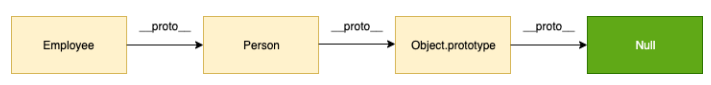

**What is hoisting?**

- Hoisting is a JavaScript mechanism where variables and function declarations are moved to the top of their scope before code execution.

**What is the Temporal Dead Zone?**

- The Temporal Dead Zone is a behavior in JavaScript that occurs when declaring a variable with the `let` and `const` keywords, but not with `var`.
- In ECMAScript 6, accessing a `let` or `const` variable before its declaration (within its scope) causes a `ReferenceError`. The time span when that happens, between the creation of a variable’s binding and its declaration, is called the temporal dead zone.

**What is pooling?**

- The server needs to be regularly monitored for updates. The aim is to check for the presence of new comments. This process is considered as pooling. It checks for the updates almost every 5 seconds. Pooling helps keep an eye on the users and ensure there is no negative information on servers.

**What does asynchronous mean?**

- Normally, a given program’s code runs straight along, with only one thing happening at once. If a function relies on the result of another function, it has to wait for the other function to finish and return, and until that happens, the entire program is essentially stopped from the perspective of the user.
- Asynchronous techniques are very useful, particularly in web programming. When a web app runs in a browser and it executes an intensive chunk of code without returning control to the browser, the browser can appear to be frozen. This is called blocking; the browser is blocked from continuing to handle user input and perform other tasks until the web app returns control of the processor.
- Asynchronous solves this problem by not waiting for other operations to complete. Imagine it like this: You are cooking pasta. You put water on the stove and are waiting for it to start boiling. That doesn’t mean you shouldn’t do anything until that, right? You can start preparing the seasoning, put up the plates, or anything else you might want to do. After the water starts boiling, you get back to it and put the pasta in it. That’s pretty much how asynchronous functions work.

**What is memoization?**

- Memoization is a programming technique that attempts to increase a function’s performance by caching its previously computed results. Each time a memoized function is called, its parameters are used to index the cache. If the data is present, then it can be returned, without executing the entire function. Otherwise the function is executed and then the result is added to the cache.

  ```javascript
  function memoize(func) {
    const storage = {};
    return function (val) {
      if (storage[val]) {
        console.log('In Storage');
        return storage[val];
      } else {
        console.log('Computating');
        storage[val] = func(vaL);
        return storage[val];
      }
    };
  }
  ```

**What are data types in JavaScript?**

- JavaScript has two data types:
  - Primitive: `string`, `number`, `boolean`, `null`, `undefined`, and `symbol`.
  - Reference: `object`, `function`, and `array`.

**What are primitive data types?**

- Primitive data types are immutable and are passed by value.

**What is the difference between primitives vs objects?**

- Primitives are immutable and passed by value, while objects are mutable and passed by reference. This means changing the value of a primitive doesn't affect other variables, but changing an object may affect other references to that object.

**What is coercion in JavaScript?**

- Coercion is the automatic type conversion that JavaScript performs when we use operators or functions with operands of different types.

**Do you know what Autoboxing in JS is?**

- Autoboxing is a feature in JavaScript where primitive data types are automatically converted to their corresponding object wrappers (e.g., `Number`, `String`, `Boolean`) when you try to access their properties or methods.

**What is the difference between == and === operators?**

- `==` compares values for equality after type coercion.
- `===` compares values for equality without type coercion.

**What is undefined data type?**

- `undefined` is a primitive data type that represents the absence of a value or uninitialized variable.

**What is null value?**

- `null` is a primitive data type that represents the intentional absence of any value or a variable that has been explicitly set to no value.

**What does isNaN function do?**

- The `isNaN()` function checks if a value is not a number. It returns `true` if the value is NaN, and `false` otherwise.

**What does NaN value mean?**

- `NaN` represents an unrepresentable or undefined value that typically results from invalid mathematical operations.

**What is the difference between `null` and `undefined?`**

- `null` is a value that represents the intentional absence of any object value.
- `undefined` is a value that represents uninitialized variables or missing properties.

**How do you copy properties from one object to another?**

- We can use method `Object.assign()`, the spread operator (`...`), or by iterating over the properties and manually copying them.

**What are classes in ES6?**

- In ES6, classes are a syntactical sugar over JavaScript's prototype-based inheritance. They provide a cleaner and more structured way to create constructor functions and prototype-based inheritance.

**Explain how prototypal inheritance works?**

- Prototypal inheritance means that objects can inherit properties and methods from other objects through their prototype chain. When you access a property or method on an object, JavaScript looks up the prototype chain to find it.

  

**How do you assign default values to variables?**

- We can assign default values to variables using the `||` operator or the new nullish coalescing operator (`??`).

**What is the difference between `let`, `const`, and `var`?**

- `var` has function-level scope, meaning that a variable declared with var is accessible within the function it is declared in, or globally if it is declared outside of a function. `var` variables can be redeclared and reassigned.
- `let` and `const` have block-level scope, meaning that a variable declared with `let` or `const` is only accessible within the block it is declared in (e.g. within a loop or an if statement).
- `let` variables can be reassigned, but not redeclared, while `const` variables cannot be reassigned or redeclared.
- `let` and `const` variables are hoisted, only they are hoisted without a default initialization. This makes them inaccessible (as such variables are in a temporal dead zone). Variables declared with `var`, on the other hand, are hoisted with a default initialization of `undefined`.

**What are the differences between undeclared and undefined variables?**

- An undeclared variable is one that has not been declared with `var`, `let`, or `const`. An undefined variable has been declared but has not been assigned a value.

**What are global variables?**

- Global variables are variables declared outside of any function or block scope and can be accessed from anywhere in the code.

**What is Hoisting?**

- Hoisting is a JavaScript behavior where variable and function declarations are moved to the top of their containing scope during the compilation phase. However, only declarations are hoisted, not initializations.

**What is scope in JavaScript?**

- Scope in JavaScript refers to the context in which variables and functions are declared and accessed. It determines their visibility and lifetime.

**What is a closure?**

- A closure is a function that has access to variables from its outer (enclosing) scope, even after that scope has finished executing. Closures are often used to create private variables and encapsulate functionality.

**How does closure implemented in JavaScript?**

- Closures are implemented in JavaScript when an inner function references variables from its outer function, creating a scope chain that retains access to those variables even after the outer function has completed execution.

**What is the difference between Call, Apply, and Bind?**

- `call` and `apply` are used to invoke functions with a specific `this` context and arguments. `bind` is used to create a new function with a specific `this` context but doesn't immediately invoke it.

**What does '`this` loses context' mean?**

- It means that the value of `this` inside a function is not what you expect. It often occurs when functions are passed as callbacks or methods are detached from their objects.

**What is JSON and its common operations?**

- JSON (JavaScript Object Notation) is a data interchange format.
- Common operations include parsing JSON strings into JavaScript objects using `JSON.parse()` and converting JavaScript objects to JSON strings using `JSON.stringify()`.

**How do you parse a JSON string?**

- You can parse a JSON string into a JavaScript object using the `JSON.parse()` method.

**What is the purpose of JSON.stringify?**

- `JSON.stringify()` is used to convert a JavaScript object into a JSON-formatted string, making it suitable for data exchange or storage.

**What array methods do you know?**

- Methods that modify initial array: `push()`, `pop()`, `shift()`, `unshift()`, `concat()`, `slice()`, `splice(), sort()`;
- iteration methods: `forEach(), includes(), some(), each()`;
- methods that return new array: `map()`, `filter()`, `reduce()`.

**What is the difference between Array.forEach() and Array.map()?**

- `forEach()` iterates over an array and executes a provided function for each element. It returns `undefined`.
- `map()` also iterates over an array but creates a new array by applying a provided function to each element.

**What are lambda or arrow functions?**

- Lambda functions, also known as arrow functions, are a concise way to write anonymous functions in JavaScript. They have a shorter syntax and inherit the `this` value from their enclosing scope.

**What is a pure function?**

- A pure function is a function that always returns the same output for the same input and has no side effects. It doesn't modify external variables or state.

**What is IIFE (Immediately Invoked Function Expression)?**

- An IIFE is a function that is executed immediately after it is defined. It's often used to create a private scope and avoid polluting the global scope.

**What is a callback function?**

- A callback function is a function passed as an argument to another function, which is then executed when a specific event or condition is met. Callbacks are commonly used in asynchronous programming.

**What is a promise? Why do we need a promise?**

- A promise is an object representing the eventual completion or failure of an asynchronous operation. Promises provide a cleaner and more organized way to handle asynchronous code compared to callbacks.

**List all states of a promise?**

- Promises can be in one of three states: `pending`, `fulfilled`, or `rejected`. Once a promise transitions to either fulfilled or rejected, it becomes settled, and its state cannot change.

**Why do we need callbacks?**

- Callbacks are used to ensure that certain code doesn't execute until a specific task, often an asynchronous one, is completed. They help manage the flow of asynchronous operations.

**What is a callback hell?**

- Callback hell (or pyramid of doom) is a situation where nested callbacks become deeply nested and hard to read, making code maintenance and debugging challenging.

**What is promise chaining?**

- Promise chaining is a technique used to execute a sequence of asynchronous operations one after another, ensuring that each operation depends on the result of the previous one. It improves code readability and reduces callback hell.

**What is the purpose of using setTimeout?**

- `setTimeout()` is used to schedule the execution of a function after a specified delay in milliseconds. It's often used for delaying tasks, animations, or simulating asynchronous behavior.

**What is the purpose of using setInterval?**

- `setInterval()` is used to repeatedly execute a function at specified intervals until it's cleared. It's commonly used for tasks that need to be performed regularly, like updating a clock.

**What is an event loop?**

- The event loop is a mechanism in JavaScript that allows the runtime to perform non-blocking I/O operations despite the fact that JavaScript is single-threaded. It is responsible for handling asynchronous callbacks and executing them in the appropriate order.

- When an asynchronous operation is initiated, it is added to a queue of pending events. The event loop continuously checks this queue for events, and when it finds one, it executes the associated callback function. This process continues until the queue is empty.

**What is the call stack?**

- The call stack is a data structure in JavaScript that keeps track of function calls. It maintains the current execution context and is used to manage the flow of program execution.

**How do you validate an email in JavaScript?**

- Using regular expressions, such as `/^\w+([\.-]?\w+)*@\w+([\.-]?\w+)*(\.\w{2,3})+$/` or 3rd party libraries.

**What are modules? Why do you need modules?**

- Modules are a way to organize and encapsulate code in separate files or modules. They help manage dependencies, improve code reusability, and prevent global scope pollution.

**What is a rest operator?**

- The rest operator (`...`) allows to gather the remaining arguments of a function into an array. It's often used in function parameters to handle variable-length argument lists.

**What is a spread operator?**

- The spread operator (`...`) is used to spread the elements of an array or object into another array or object. It's often used for creating copies or merging arrays/objects.

**What is Node.js?**

- Node.js is a runtime environment that allows to execute JavaScript on the server-side. It provides a platform for building scalable and efficient network applications.

**What is the difference between `window` and `document`?**

- `window` is the top-level object in the browser's JavaScript object hierarchy, and it represents the browser window or tab that the script is running in. It provides access to various properties and methods related to the browser window, such as `window.innerWidth` and `window.location`.
- `document` is a property of the `window` object and represents the current web page loaded in the browser. It provides access to the HTML content and allows manipulation of the DOM (Document Object Model) For example, you can use `document.getElementById()` to get a reference to an HTML element by its ID, and then manipulate its properties or contents..

## Array methods

**`slice` vs `splice`**

- The `slice()` method returns the selected elements in an array as a new array object. It selects the elements starting at the given start argument and ends at the given optional end argument without including the last element. If you omit the second argument then it selects till the end.

- The `splice()` method is used to either adds/remove items to/from an array and then return the removed item. The first argument specifies the array position for insertion or deletion whereas the optional second argument indicates the number of elements to be deleted. Each additional argument is added to the array.

- Note: The `splice` method modifies the original array and returns the deleted array.

## Functions

**What are lambda or arrow functions?**

- An arrow function is a shorter syntax for a function expression and does not have its own this, arguments, or super reference. A lambda function is called an anonymous function (no label). These functions are best suited for non-method functions (not in a class), and they cannot be used as constructors.

**What is a first-class function?**

- First-class functions mean when functions in that language are treated like any other variable. A function can be passed as an argument to other functions, can be returned by another function, and can be assigned as a value to a variable.

**What is a callback function?**

- A callback function is a function that is passed into another function as an argument which is then invoked inside the outer function.

**What is a pure function?**

- Any function that does not change the internal state of one of its arguments or the value of some external data. It must only depend on its input arguments. They do not have any side effects like network or database calls. If you call this function n times with the same arguments it will return the same results every time.

**What is a higher-order function?**

- A higher-order function is a function that accepts another function as an argument or returns a function as a return value or both.

## Events

**`Event.target` vs `event.currentTarget`**

- `event.target` and `event.currentTarget` are properties commonly used in JavaScript when handling events. They refer to different elements involved in an event and can often be confused.

  - `event.target`: This property refers to the element that triggered the event. It identifies the most specific element that initially caused the event. For instance, if you have a click event on a button inside a div, clicking the button will make the button element the `event.target`.

  - `event.currentTarget`: This property refers to the element that the event handler is currently attached to. It does not change as the event bubbles up or propagates through the DOM (Document Object Model). It always remains the element to which the event handler is bound.

- The difference can be more evident when dealing with nested elements or event delegation. Event delegation is the practice of using a single event listener to manage multiple elements. In this context, `event.currentTarget` remains constant (representing the element the event is delegated to), while `event.target` can vary based on the actual target that triggered the event within the delegated element.

- Here's an example to illustrate this difference:

  ```html
  <div id="outer">
    <button id="inner">Click me</button>
  </div>
  ```

  ```javascript
  document.getElementById('outer').addEventListener('click', function (event) {
    console.log('Current Target: ' + event.currentTarget.id);
    console.log('Target: ' + event.target.id);
  });
  ```

- In this case, clicking the button with the ID "inner" will log:

  - `Current Target: outer` (because the event listener is attached to the "outer" div)
  - `Target: inner` (since the button triggered the event)

- Understanding these properties is crucial for handling events in JavaScript, especially when dealing with complex DOM structures or implementing event delegation.

**`stopPropagation()` vs `stopImmediatePropagation()`**

- Both `stopPropagation()` and `stopImmediatePropagation()` are methods used in JavaScript to manage event propagation in the DOM. They affect how events bubble or propagate through the DOM hierarchy.

  - **`stopPropagation()`:** This method is used within an event handler to prevent the further propagation of the current event in the capturing and bubbling phases. When `stopPropagation()` is called on an event, it halts the event from propagating up the DOM tree, but it doesn’t stop the event from being executed on the current target. Other event handlers on the same element will still be executed.

    ```javascript
    element.addEventListener('click', function (event) {
      event.stopPropagation();
      // Other click handlers on the same element will still be triggered
    });
    ```

  - **`stopImmediatePropagation()`:** This method, when called within an event handler, stops the event from propagating immediately and prevents any other handlers on the same element from being executed. It not only prevents the event from reaching the elements further up the DOM tree, but also stops other event handlers on the same element from running.

    ```javascript
    element.addEventListener('click', function (event) {
      event.stopImmediatePropagation();
      // Other click handlers on the same element will not be triggered
    });
    ```

- Understanding these methods is crucial when handling events in a complex DOM structure and wanting to control how events propagate through the elements.

**Differents between `load` and `DOMContentLoaded`?**

- The `load` and `DOMContentLoaded` events are both related to the loading and initialization of a web page in the browser, but they differ in terms of when they are triggered and what they signify.

  - **`DOMContentLoaded` event:**
    - This event is fired when the HTML document has been completely loaded and parsed, but external resources like stylesheets, images, and subframes may still be loading.
    - It indicates that the DOM content is ready, allowing you to interact with and manipulate the document's structure. This event is often used to run JavaScript that requires access to the DOM elements but doesn't need to wait for the complete loading of external resources.
    - It's usually the preferred event to use when you want to execute JavaScript as soon as the DOM is ready.

  ```javascript
  document.addEventListener('DOMContentLoaded', function () {
    // This code runs when the DOM is fully loaded and ready for manipulation
  });
  ```

  - **`load` event:**
    - This event is triggered when the entire page, including all its external resources (images, stylesheets, scripts, etc.), has finished loading.
    - It signifies that the entire page, including all its resources, is ready. This event is typically used for tasks that require all elements, including images and other resources, to be loaded.

  ```javascript
  window.addEventListener('load', function () {
    // This code runs when the entire page and its resources (images, styles, etc.) are loaded
  });
  ```
